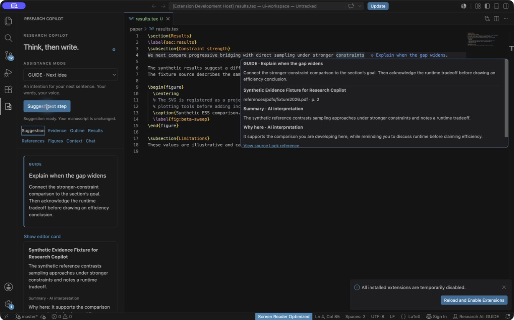
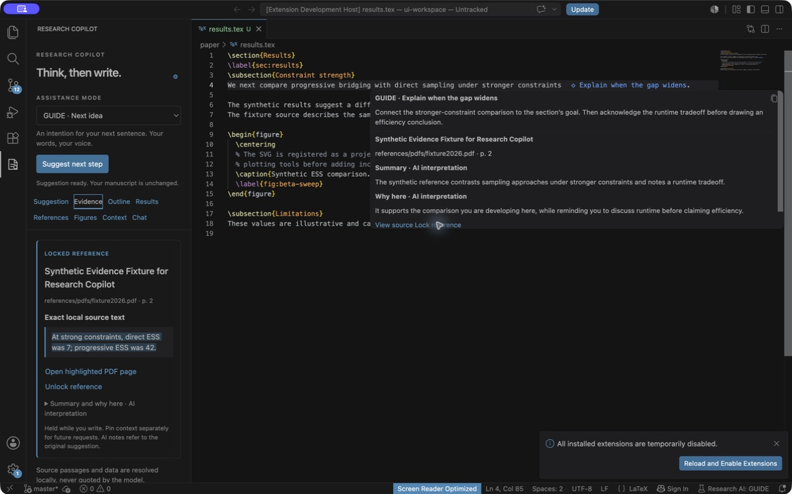
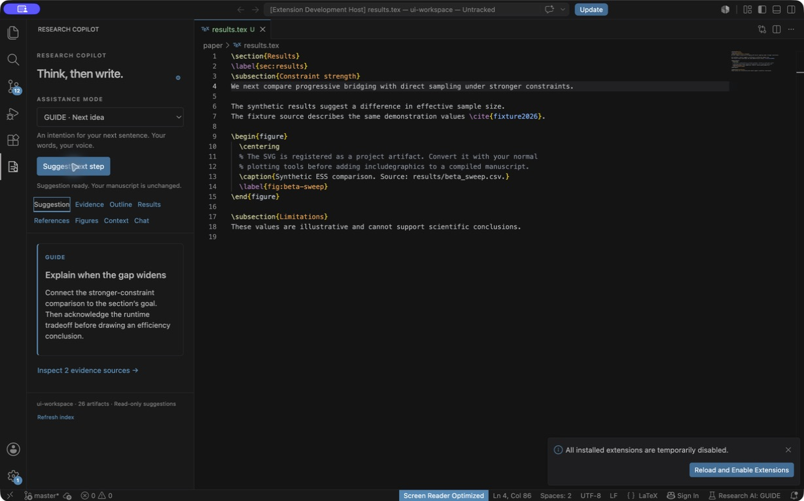
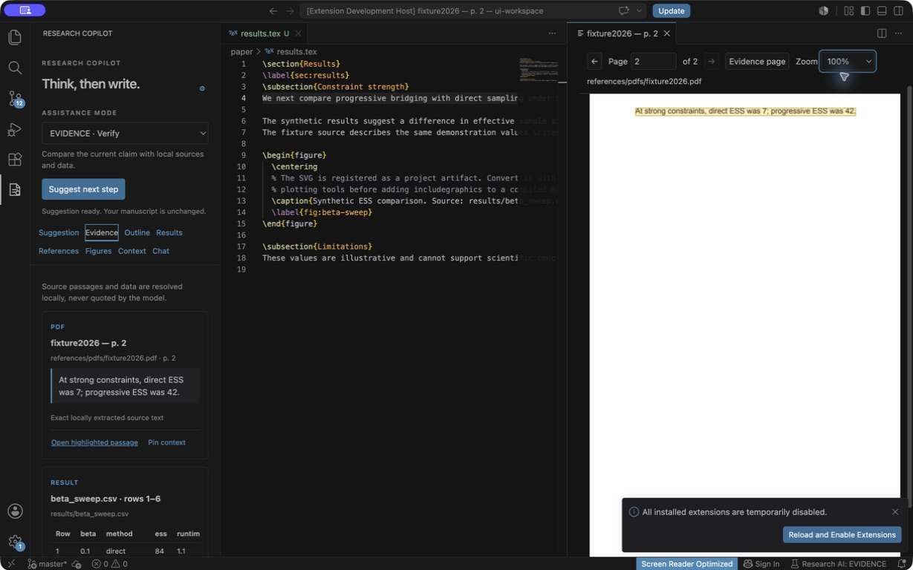

# Validation record

Validated on 1 September 2026. These are implementation checks, not evidence that a model's scientific interpretation is correct.

## Automated checks

- `npm run verify`: strict TypeScript, 47 TypeScript tests, 15 Python tests (including PDFium/Pillow and YAML), and the production bundle pass locally.
- `npm run test:extension`: passes in a real VS Code 1.127 extension host with a disposable workspace, a deterministic loopback HTTP fixture, and the real Python helper. No cloud model is called by these tests.
- Host coverage includes activation without inference, all six modes, `.tex` and `.txt` GUIDE/WRITE behavior, token/session accounting, GUIDE topic/reference hover contents, grounded reference shortlists and current-token actions, read-only suggestions, highlighted-passage commands with backward selection normalization, grounded WRITE, invented-citation rejection, exact/partial/selection-scoped WRITE cache hits, concurrent request coalescing, explicit regeneration, dirty-source cache invalidation, OFF with explicit Chat, diff review and explicit apply, stale-review rejection, unsaved-source omission, cancellation, evidence watchers, request inspection, sidebar activation, automatic debounce, and OFF suppression.
- The Linux CI run exercised native inline acceptance and Undo in a focused Xvfb host. Native inline rendering/acceptance and Undo depend on OS window focus. The host suite checks them when focused; when a macOS background host cannot execute native editor commands, it reports that limitation and restores only its disposable fixtures. Manual checks cover native acceptance and Undo separately.
- `npm run setup` prepares the repository's Python environment without modifying system Python. `vsce package --no-dependencies` produces a 152.21 KB VSIX including the user guides, with no node_modules, models, Python wheels, tests, or development dependencies.
- `npm audit --omit=dev`: no production dependency vulnerabilities reported (there are no production npm dependencies).

The tests were developed alongside the implementation. New failing regressions led to fixes for stale or fabricated evidence, numeric-sign parsing, unsafe TeX directives, changed configuration, late CSV slices, outdated relationship confirmation, PDF highlight compositing, stale sidebar snapshots, cancellation before a Codex turn ID arrives, macOS path aliases creating duplicate editor buffers, and unsaved changes shifting section offsets.

## Documentation and packaging audit

- Audited usage/configuration instructions against the sidebar, command manifest, parsers, provider adapters, and local storage behavior. All 18 user commands and all 16 setting defaults are documented.
- Checked local Markdown links and anchors, parsed JSON/YAML examples, and syntax-checked shell examples. Exercised the documented project configuration, Markdown/YAML outlines, and BibTeX-to-PDF matching against the real indexer in a disposable copy of the synthetic study.
- Re-ran `npm run package` (including all 62 core/indexer tests) and `npm run test:extension`. The macOS host passed, including native GUIDE reference contents/actions, highlighted-text commands, plain-text GUIDE/WRITE, and usage accounting; its background-window limitation for native inline acceptance/Undo remains documented.
- Inspected the resulting ZIP: all four user-guide files are included and match their repository sources; relative guide links resolve within the installed package. A dedicated guide index avoids relying on the root README filename, which the packager lowercases. Developer docs/screenshots remain in the repository rather than increasing the installed package.
- Clarified subscription versus API setup, artifact versus file exclusions, Git discovery behavior, retrospective request inspection, manual outline/status management, and currently unimplemented features. The v0.3.0 documentation audit needed no live inference; the separate paid v0.3.1 reliability check is recorded below.

## Live backend check

`scripts/smoke-codex.ts --generate` successfully authenticated through existing Codex ChatGPT credentials, listed seven models, and produced a schema-constrained GUIDE response for synthetic text. It did not send a research repository or any user source material. CLI 0.151.0 passed; the machine's older 0.133.0 CLI advertised a configured model that required a newer client. The development dependency supplies the tested version without replacing system Codex.

The OpenAI Responses, Grok/xAI Chat Completions, and loopback adapters are covered by protocol/HTTP tests. Checks include fixed xAI routing, bearer authentication, strict output schema, compact WRITE responses, prompt-prefix stability, cache usage reporting, no tools/redirects, cancellation, malformed key rejection, redacted HTTP errors, refusals, malformed JSON, and the response-size limit. Arbitrary third-party local models and paid OpenAI API inference have not been live-tested. Servers must support the documented structured-output request format.

`scripts/smoke-grok.ts` made paid xAI calls using only a synthetic manuscript fragment. The original Grok 4.6/full-schema WRITE path took 23,378 ms. An earlier Grok 4.3 compact-schema request took 941 ms; the v0.3.1 live request took 1,056 ms, reported 676 input tokens (128 cached), 21 output tokens, and an exact provider cost of $0.0007631, then passed local integrity validation. These single-call results are observations, not latency or price guarantees. The key was read from an explicitly supplied local file, was not printed, and remains in VS Code SecretStorage. The installed demo routes every mode to Grok; provider and WRITE override settings remain available.

The real host measured an exact in-process WRITE cache hit at 2 ms with no model call. It also verified that typing `with progressive ESS reaching 4` reuses only `2.` after revalidating the underlying result hash. Cache tests cover the two-minute TTL, 32-entry/2 MiB LRU bounds, full surrounding-text match, source/config invalidation, and explicit cache clearing.

The installed v0.3.3 demo used **Cmd+Option+G** on a highlighted synthetic plain-text passage and displayed native Grok ghost text after the logical end of the selection without changing the file. The sidebar reported one request, 5,688 tokens, and an exact $0.0070 provider cost. Pressing **Cmd+Option+G** again kept the same one-request session count. Reselecting the same passage and pressing **Cmd+Option+H** reported **Cache hit · 0 new tokens · $0.0000**, which verifies the installed keyboard command and selection-scoped cache path. These are one-request observations, not price or token guarantees.

## v0.2 regression and visual checks

New failing tests preceded the Grok adapter and source-card implementation. The real host now checks native GUIDE hover contents, source locking, exact locally resolved quotation text, cursor movement, stale action tokens, source-file changes, and dirty source buffers. WRITE remains a native completion with no GUIDE card. Focused macOS runs exercised native acceptance and Undo. The updated output schema also passed a live Codex request using only the synthetic smoke-test text.

The new native hover and left-side locked quotation were checked in a disposable VS Code workspace. This exposed duplicate hover content and non-wrapping text; both were fixed. The quote now precedes expandable AI notes so it remains visible in a narrow sidebar. Screenshots below show synthetic fixtures, not live Grok responses.

## v0.2.2 GUIDE reference checks

New failing tests preceded the reference-shortlist change. Unit coverage verifies PDF-first citation deduplication and bounded tooltip contents without exact quotation duplication. DOM coverage verifies two references appear alongside the topic, hostile titles/details render only as text, and hover/focus explanations remain keyboard accessible. The real extension host verifies the native card contains the suggested-reference section, detail tooltips, AI-interpretation labels, and a grounded source shortlist before exercising the existing exact-source lock lifecycle.

## v0.3.0 provider, plain-text, and panel checks

New failing tests captured the old Codex default, `.txt` rejection, flat tab list, and missing provider control before implementation. Tests now assert all-mode Grok routing by default plus explicit provider overrides, plain-text heading/section indexing and unsaved offsets, `.txt` reviewed edits and citation placeholders, safe grouped DOM navigation, and the provider Settings action. The real extension host opens a Plain Text editor and completes both GUIDE and WRITE against its live cursor without changing the document.

## v0.3.1 live reliability and usage checks

A paid request from the installed demo reproduced a Grok response containing valid structured JSON followed by extra content. Failing regressions captured that parse error, opaque network failures, absent cost conversion, and the missing footer. The adapter now deterministically takes the first complete object, retains strict local validation, reports safe network guidance, reads xAI's exact `cost_in_usd_ticks`, and falls back to documented Grok pricing only when needed. DOM and real-host tests verify the visible last-request/session counts without making CI contact a paid provider.

## Earlier visual checks

The running extension was inspected in VS Code on macOS. Checks included mode selection, GUIDE cards, native WRITE ghost text followed by Tab and Undo, exact local quotations, PDF page navigation, return to the evidence page, zoom, and explicit Chat diff approval followed by native Undo. The highlight preserves the original glyphs. Screenshots use deterministic synthetic responses and a synthetic PDF; they are not live-model or real research examples.

## Lightweight index check

Run `.venv/bin/python scripts/benchmark.py` to reproduce the generated dataset. One local macOS arm64 run indexed 101 files, including a 100,000-row CSV, into 4,301 artifacts:

| Operation | Observed time |
| --- | ---: |
| First scan | 555 ms |
| Unchanged scan | 23 ms |
| Ranked search finding the final CSV row | 52 ms |

The resulting SQLite file was 17,068,032 bytes. These are one-machine smoke measurements, not performance guarantees or a comparison with another product. No embedding service or model call is involved.

## Scope and remaining limitations

- The delivered scope is the local VS Code MVP, Stages A–C. Standalone packaging, collaboration, OCR, Zotero, Parquet, automatic figure creation and experiment execution remain deferred.
- The model receives bounded, mode-specific context assembled through scoped read-only retrieval operations. Those operations are available to the local core; this version does not let the model invoke an open-ended tool loop. Codex shell, connectors, filesystem writes and approval requests are disabled/denied.
- External resource directories must be placed under a common opened workspace folder. Escaping symlinks and external paths are rejected. Multi-root workspaces use the active manuscript's root.
- Retrieval uses local lexical relevance, mode priorities, pins and confirmed relationships. It is not a semantic search benchmark. Confirmations expire when either source hash changes.
- TeX structure parsing handles the supported commands and nested braces, not arbitrary macro expansion. PDF text order depends on the PDF's text layer; scanned or unreadable sources remain unverified.
- Numeric validation verifies an exact current cell locator. It does not establish scientific validity, correct units, causal support, or a statistically sound interpretation. Automatic computation is intentionally absent.
- macOS has been exercised locally. GitHub CI runs Linux with a real extension host under Xvfb. Windows remains unverified; use F5 if the `code` launcher is unavailable.

The [initial complete Linux CI run](https://github.com/vik1000-coder/writingTool/actions/runs/33364355998) passed verification, native editor integration, and packaging. GitHub workflow results provide the authoritative CI status for each commit. The repository remains private; no Marketplace or public release has been published.
